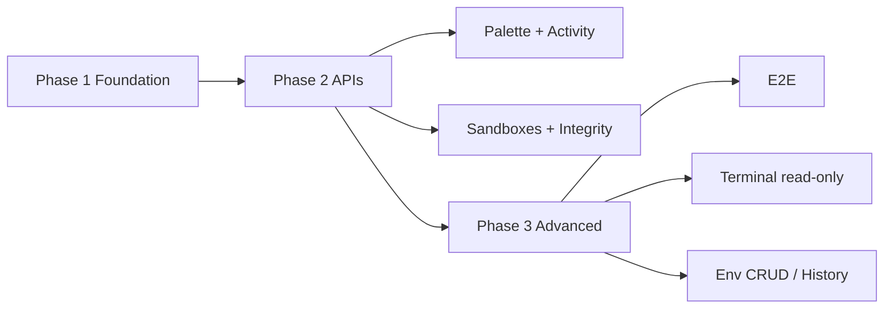

# Vader Engine — Dashboard Integration Roadmap

**Product:** Vader Protocol · **UI:** Vader Construct · **Package:** `ui/dashboard/` · **Port:** `3010`  
**Branch:** `feat/v0-core-integration-v1` (successor to `feat/vader-construct-dashboard-v2`)  
**Baseline:** v2.5.0-Engine · **Grader target:** 61/61  
**Operator runbook:** [v0-Run-Sheet.md](../docs/v0-Design/v0-Run-Sheet.md) · **Handoff:** [v5-Implementation.md](../docs/v0-Design/v5-Implementation.md)

---

## Executive summary

The v0 dashboard is the **visual control plane** for Vader Engine. Integration follows **Lean Boundary**: the dashboard is an isolated Next.js app under `ui/dashboard/` that shells out to existing `msc:*` scripts at repo root via App Router API routes—no duplicated grader/health logic in the UI layer.

**Path:** Path B (Tailwind 3 + shadcn) with token SSoT in `ui/msc-shield.css`.

---

## Immediate 5-step checklist (do now)

| # | Action | Command / check | Pass criteria |
| --- | --- | --- | --- |
| 1 | **Verify integration** | Confirm `ui/dashboard/package.json`, `app/`, `components/` exist | Folder tracked in git; not only on disk outside repo |
| 2 | **Validate repo gates** | `npm run grade` · `npm run msc:lint` · `npm run msc:test:root` | **61/61** · **0** lint issues · **8/8** tests |
| 3 | **Naming & tokens** | `globals.css` → `@import '../../ui/msc-shield.css'`; `tailwind.config.ts` maps `var(--msc-*)` | No hardcoded `#121212` in TSX; no CSS modules |
| 4 | **Route smoke** | `npm run msc:dev:dashboard` (after script added) → `http://127.0.0.1:3010` | All routes from [v0-Run-Sheet.md](../docs/v0-Design/v0-Run-Sheet.md) return 200 |
| 5 | **Test IDs** | `git grep -n "data-testid" ui/dashboard` | Required IDs from § Architecture mapping present |

---

## Architecture mapping (`data-testid` → backend)

| `data-testid` | UI surface | Phase | Connects to |
| --- | --- | --- | --- |
| `run-grader-button` | Integrity · Run Grader | 2 | `GET /api/grade` → `npm run grade` (parse stdout) |
| `sandbox-card-3000` | Dashboard · Minimal | 2 | `GET /api/health` + `POST /api/run-script` (`msc:dev:example` / kill **3000**) |
| `sandbox-card-3001` | Dashboard · Payload | 2 | same (`msc:dev:payload` / **3001**) |
| `sandbox-card-3002` | Dashboard · Tailwind | 2 | same (`msc:dev:tailwind` / **3002**) |
| `command-palette-trigger` | Footer command bar | 2 | Opens palette → `POST /api/run-script` for whitelisted commands |
| `command-palette` | Cmd+K dialog | 2 | Navigation + script dispatch (allowlist) |
| `stop-sandbox-confirm` | AlertDialog · STOP | 2 | `POST /api/run-script` → `node scripts/msc-kill-dev-port.mjs <port>` |
| `kill-port-confirm` | AlertDialog · kill port | 2 | same pattern |
| `activity-feed` | Dashboard activity strip | 2 | `GET /api/logs` (SSE) from script stdout buffer |
| `footer-brand` | Footer | 1 | Static copy only |
| `protocol-readiness-card` | Placeholder routes | 1 | Mock readiness until Phase 2 metrics |
| `nav-*` | Sidebar links | 1 | Next.js routing only |

### Expected `ui/dashboard/` file touchpoints (v0 → wired)

| Area | Typical paths | Integration |
| --- | --- | --- |
| App shell | `app/layout.tsx`, `components/app-shell/*` | Persistent sidebar/header/footer/command bar |
| Dashboard | `app/page.tsx`, `components/dashboard/*` | Bento grid + sandbox cards + activity feed |
| Integrity | `app/integrity/page.tsx` | Grade hero + `run-grader-button` |
| Operations | `app/operations/**` | Scripts, ports, env (Phase 2) |
| API routes | `app/api/health/route.ts`, `grade`, `run-script`, `logs` | **Create in Phase 2** — spawn from `MSC_PROJECT_ROOT` |
| Shared lib | `lib/msc-api.ts`, `lib/msc-allowlist.ts` | Client fetch helpers + script allowlist |
| Styles | `app/globals.css`, `tailwind.config.ts` | Shield import + Path B bridge |

**Safety:** All API route handlers must resolve repo root via `MSC_PROJECT_ROOT` from `scripts/lib/msc-load-env.mjs` (or `path.resolve(process.cwd(), '../..')` when `cwd` is `ui/dashboard`). **Never** hardcode `D:\` or machine-specific paths.

---

## Phase 1 — Foundation (integration, routing, mock data)

**Goal:** Dashboard runs on **3010**, visually correct, routes complete, repo gates green.

### 1.1 Lean Boundary package

- [ ] `ui/dashboard/package.json` — isolated deps (Next 15, React, shadcn, TanStack Query, Zustand)
- [ ] Root `package.json` — add only: `"msc:dev:dashboard": "cd ui/dashboard && npm run dev -- -p 3010"`
- [ ] Root `.gitignore` — `ui/dashboard/node_modules/`, `ui/dashboard/.next/`, `ui/dashboard/.env.local`
- [ ] `ui/dashboard/README.md` — port, env, API overview

### 1.2 Token bridge (Path B)

- [ ] `ui/dashboard/app/globals.css` imports `../../ui/msc-shield.css` (and optional `studio-dark-shield.css`)
- [ ] `tailwind.config.ts` mirrors [examples/nextjs-tailwind/tailwind.config.ts](../../examples/nextjs-tailwind/tailwind.config.ts) (`msc-*` → `var(--msc-*)`)
- [ ] Glass/gleam effects use Shield extension tokens or scoped utilities—no ad-hoc hex in components
- [ ] `prefers-reduced-motion` respected ([v0-Run-Sheet.md](../docs/v0-Design/v0-Run-Sheet.md))

### 1.3 Routing & IA

Verify sidebar matches canonical order ([v4-Operations.md](../docs/v0-Design/v4-Operations.md)):

| Route | Page |
| --- | --- |
| `/` | Dashboard (Bento) |
| `/projects` | Projects |
| `/templates` | Templates |
| `/sandboxes` | Sandboxes |
| `/integrity` | Integrity |
| `/operations`, `/operations/scripts`, `/operations/ports`, `/operations/env` | Operations |
| `/protocols` | Protocols |
| `/settings` | Settings |

- [ ] Each placeholder route uses **Protocol Readiness** card (not generic “Coming Soon”)
- [ ] Footer: `Powered by Vader Engine` · Command bar: `Type / for commands`

### 1.4 Port & health contract

- [ ] Add **3010** to `scripts/msc-kill-all-dev-ports.mjs`
- [ ] Extend `scripts/health.mjs` + `scripts/__tests__/health.test.mjs` for port **3010**
- [ ] Document **3010** in `.cursor/docs/system-architecture.md`

### 1.5 Gate verification (document results in `project-log.md`)

```bash
npm run grade          # expect 61/61 (100%)
npm run msc:lint       # expect 0 errors (file count grows with ui/dashboard)
npm run msc:test:root  # expect 8/8
```

**Note:** Until `ui/dashboard/` is committed, grader may not yet check dashboard package—Phase 1 exit adds optional grader check: `ui/dashboard/package.json exists`.

### Phase 1 exit criteria

- [ ] `cd ui/dashboard && npm install && npm run build` exits **0**
- [ ] Dev server on **3010** serves all routes
- [ ] All required `data-testid` attributes present (grep audit)
- [ ] Root gates pass

---

## Phase 2 — Logic & integration

**Goal:** Replace mocks with real script execution and streaming logs.

### 2.1 Shared spawn layer (repo root)

Create under `scripts/lib/` (imported by API routes in dashboard):

| Module | Responsibility |
| --- | --- |
| `msc-spawn-script.mjs` | `spawn('npm', ['run', script], { cwd: MSC_PROJECT_ROOT, env: process.env })` |
| `msc-parse-grade.mjs` | Parse `grade` stdout → `{ passed, total, checks[] }` |
| `msc-script-allowlist.mjs` | Whitelist `package.json` scripts only—reject arbitrary shell |

**Naming:** exported functions use `msc_` prefix where exposed to PHP consumers later; Node modules use `msc-` filenames per repo convention.

### 2.2 API routes (`ui/dashboard/app/api/`)

| Route | Method | Backing |
| --- | --- | --- |
| `/api/health` | GET | `npm run msc:health -- --json` or socket probe wrapper |
| `/api/grade` | GET | `npm run grade` → parsed JSON |
| `/api/run-script` | POST | Body: `{ script: 'grade' \| 'msc:lint' \| ... }` — allowlist only |
| `/api/logs` | GET (SSE) | Stream stdout/stderr from active spawn |

**Implementation notes:**

- API routes run in Next.js on port **3010** but **spawn with `cwd: MSC_PROJECT_ROOT`** (two levels up from `ui/dashboard`).
- Use `child_process.spawn` (not `exec` with shell strings) for safety.
- Redact secrets from streamed logs (no `.env.local` contents).

### 2.3 UI wiring

| Feature | Work |
| --- | --- |
| Command Palette | Map commands to allowlisted `POST /api/run-script` |
| Activity feed | Subscribe to `/api/logs` SSE; append lines with relative timestamps |
| Sandbox STOP | `AlertDialog` → `stop-sandbox-confirm` → kill port script |
| Integrity | `run-grader-button` → `/api/grade` → display **61/61** + failure accordion |
| TanStack Query | Poll `health` every 5s; invalidate on mutations ([v3-State-Data.md](../docs/v0-Design/v3-State-Data.md)) |

### 2.4 Environment variables (`.env.example`)

Add to root `.env.example` (placeholders only—values in `.env.local`):

```bash
# Vader Construct dashboard (ui/dashboard — port 3010)
MSC_DASHBOARD_PORT=3010
MSC_DASHBOARD_HOST=127.0.0.1
# Optional: restrict dashboard API in shared environments (Phase 2+)
# MSC_DASHBOARD_API_TOKEN=your_dashboard_api_token
```

| Variable | Required | Purpose |
| --- | --- | --- |
| `MSC_DASHBOARD_PORT` | No (default **3010**) | Dev server port |
| `MSC_DASHBOARD_HOST` | No (default **127.0.0.1**) | Bind address for smoke/docs |
| `MSC_DASHBOARD_API_TOKEN` | No | Optional bearer check on `/api/*` if dashboard exposed beyond localhost |

**Not required:** `LOG_STREAM_URL` — use same-origin relative `/api/logs` SSE.  
**Not required:** `VADER_API_KEY` — prefer `MSC_DASHBOARD_API_TOKEN` naming if auth is added.

### Phase 2 exit criteria

- [ ] Command palette runs `grade`, `msc:lint`, `msc:kill-dev-port` successfully
- [ ] Activity feed shows live script output
- [ ] STOP + kill flows confirmed via dialog + port free on health poll
- [ ] Integrity page shows live grader score
- [ ] `npm run start-project:gate` still **61/61**

---

## Phase 3 — Advanced features

**Goal:** Operator depth, observability, regression safety.

### 3.1 Playwright E2E

- [ ] Extend `e2e/` or add `ui/dashboard/e2e/` with tests keyed on `data-testid`
- [ ] Flows: open palette, navigate `nav-integrity`, trigger `run-grader-button` (mock API in CI optional)
- [ ] Wire into `npm run msc:e2e` when stable

### 3.2 Env Manager CRUD (P1)

- [ ] Replace read-only `/operations/env` with masked table
- [ ] Never expose `.env.local` over network—local file edits only or server-side redacted view

### 3.3 Grade history

- [ ] Persist grade runs (file or SQLite under `data/`—gitignored)
- [ ] Recharts trend on Integrity page

### 3.4 `/operations/terminal` (xterm.js) — draft plan

Execute after Phase 2 is stable.

| Decision | Recommendation | Rationale |
| --- | --- | --- |
| Transport | **SSE first** for log tail; **WebSocket** only if bidirectional PTY required | SSE matches existing `/api/logs` design; simpler auth |
| Process model | **Phase 3a:** `child_process` spawn (no PTY) — logs only | Matches current script runner; lowest risk |
| **Phase 3b:** `node-pty` behind feature flag | Full terminal (vim, prompts) | Requires native bindings; Windows CI complexity |
| Security | Allowlist commands only; no raw shell; max buffer size; kill on timeout | Prevents RCE via palette/terminal |
| Input validation | Strip ANSI control sequences from client input in non-PTY mode; rate-limit keystrokes | Prevents escape injection |
| Sandboxing | Localhost bind only; optional `MSC_DASHBOARD_API_TOKEN`; disable in production deploy until reviewed | Control plane must not be public by default |
| UI | `xterm.js` in `/operations/terminal` · fit addon · copy selection | Reuse log stream endpoint initially |

**Milestone sequence:**

1. Terminal view renders SSE log stream (read-only)
2. Add “run script” attach with spawn session id
3. Optional PTY upgrade behind `MSC_TERMINAL_PTY=1` in `.env.local`

### Phase 3 exit criteria

- [ ] E2E smoke for dashboard critical paths
- [ ] Terminal page read-only log mode shipped
- [ ] Env CRUD or grade history (at least one) shipped

---

## Vader Protocol compliance checklist

| Rule | Enforcement |
| --- | --- |
| `msc_*` / `msc-*` naming | Backend helpers in `scripts/lib/msc-*.mjs`; UI classes `msc-*` via Tailwind bridge |
| PHP `defined('ABSPATH') \|\| exit;` | Only if adding PHP bridge files under `core/` |
| Dark-mode readability | Tokens from `msc-shield.css`; accent `#e02b20`; success `#1D9E75` |
| No inline styles / CSS modules | Tailwind + shadcn only in dashboard |
| No invented npm scripts | UI maps 1:1 to root `package.json` ([v4-Operations.md](../docs/v0-Design/v4-Operations.md) §8) |
| Zero-leak | API never returns secret env values |
| Fix-local-first | `msc:kill-dev-port` before declaring port conflicts resolved |

---

## Suggested implementation order (sprints)



| Sprint | Deliverable |
| --- | --- |
| S1 | Phase 1 complete — dashboard on 3010, tokens, routes, test IDs |
| S2 | `/api/health`, `/api/grade`, spawn lib |
| S3 | `/api/run-script` + command palette |
| S4 | `/api/logs` SSE + activity feed |
| S5 | Sandbox STOP/kill + integrity UX polish |
| S6 | Phase 3 E2E + terminal read-only |

---

## References

| Doc | Path |
| --- | --- |
| Constitution | `TRUTH.md` |
| v0 workflow | `.cursor/docs/v0-Design/v0-Run-Sheet.md` |
| State/data | `.cursor/docs/v0-Design/v3-State-Data.md` |
| Path B rules | `.cursor/rules/tailwind-shadcn-bridge.mdc` |
| Studio Dark skill | `.cursor/skills/studio-dark-shield.md` |
| Port matrix | `.cursor/docs/system-architecture.md` |

---

*Last updated: 2026-05-26 · Owner: Vader Construct / `feat/vader-construct-dashboard`*
