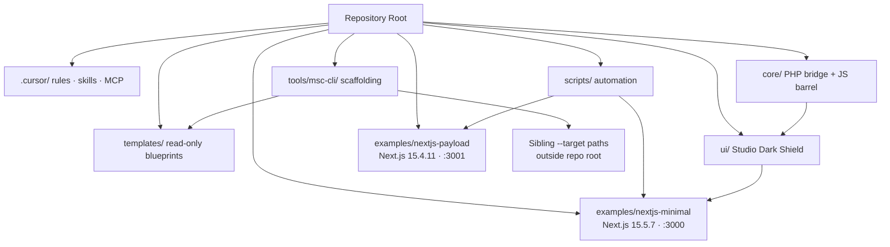

# Architecture

High-level layout of the **MSC v2.2.0** boilerplate.

## Lean Boundary

Root `package.json` orchestrates scripts only. Framework dependencies live in `examples/*` sandboxes. No Payload databases or Next.js runtime at repo root.

**Template rule:** `templates/` is read-only in Git. The scaffolding CLI (`npm run msc:template -- apply`) writes to `../Dev-Projectz/<slug>` by default, an explicit `--target` sibling path, or `.sandbox/` for seed fallback — never mutates blueprints in place.

## Sandboxes

| Sandbox | Next.js | Purpose | Port |
|---------|---------|---------|------|
| `examples/nextjs-minimal` | ^15.5.7 | Frontend baseline + Vitest | **3000** |
| `examples/nextjs-payload` | 15.4.11 (locked) | Payload CMS v3 + SQLite | **3001** |

Peer-dependency split is intentional — Payload v3.x requires the locked Next pin; workspaces remain fully isolated.

## Template scaffolding layer (v2.2.0)

| Path | Role |
|------|------|
| `templates/frontend/portfolio/` | Shield UI portfolio blueprint |
| `templates/cms/divi-bridge/` | WordPress/Divi bridge (`ABSPATH` guard) |
| `templates/full-stack/task-manager/` | Payload collection stubs |
| `tools/msc-cli/cli.mjs` | Command router: `list`, `apply`, `seed`, `doctor` |
| `tools/msc-cli/scripts/template-engine.mjs` | Copy + `{{TOKEN}}` injection |
| `tools/msc-cli/scripts/demo-seeder.mjs` | Mock JSON persistence (`seed-payload.json`) |
| `tools/msc-cli/scripts/utils.mjs` | Port probe, slugify, variable injection helpers |

## WordPress Shield

PHP entry: `core/msc-bootstrap.php`. Divi consumer bridge: `core/core-Divi-Scriptz.js` (exact casing). CSS namespace: `msc-` prefix via `ui/msc-shield.css`.

## Validation & quality gates

| Gate | Command | When |
|------|---------|------|
| Template CLI health | `npm run msc:template -- doctor` | After scaffolding changes |
| Multi-sandbox E2E | `npm run msc:e2e` | CI after sandbox builds; 3 tests × chromium + firefox |
| Environment scan | `npm run msc:validate-env` | Pre-commit, CI |
| MCP structure | `npm run verify:mcp` | Pre-commit, CI |
| Lint/format | `npm run msc:lint` | CI, local |
| Structural grader | `npm run grade` | Pre-push, CI — **52 checks** |
| Root tests | `npm run msc:test:root` | Pre-push, CI |
| Full test sweep | `npm run msc:test:all` | Release audit |
| Shield compliance | `npm run msc:shield:audit` | UI work |

## CI pipeline (GitHub Actions)

On push/PR to `main`:

1. `npm ci`
2. `msc:validate-env`
3. `verify:mcp`
4. `msc:lint`
5. `grade`
6. `msc:test:root`
7. `examples/nextjs-minimal` — `npm ci` + test
8. `examples/nextjs-payload` — `npm ci` + build (requires `PAYLOAD_SECRET`)
9. Playwright install + `npm run msc:e2e` (mkdir `database/`, uses `payload-e2e.db`)

## Git hooks

| Hook | Runs |
|------|------|
| **pre-commit** | lint-staged (Biome on JS/TS/JSON/CSS) → `msc:validate-env` → `verify:mcp` |
| **pre-push** | `grade` → `msc:test:root` |

## Port registry

| Port | Target |
|------|--------|
| **3000** | Minimal frontend sandbox |
| **3001** | Payload full-stack sandbox |
| **3002+** | Scaffolded projects (dynamic via `msc_findFreePort`) |
| **8080** | Reserved (WordPress / microservices) |
| **4000** / **8000** | LiteLLM AI proxy (optional) |

## Command authority

All npm scripts are defined in root `package.json`. Agent inventory: [Code-Jedi.md](.cursor/docs/Code-Jedi.md). Operator runbook: [HOW-TO.md](.cursor/docs/HOW-TO.md). Conventions: [CONTRIBUTING.md](CONTRIBUTING.md).

Deep structural map: [system-architecture.md](.cursor/docs/system-architecture.md).
