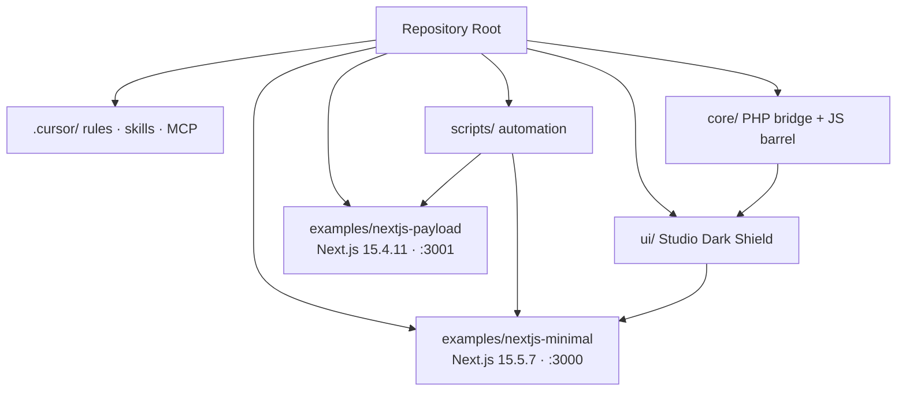

# Architecture

High-level layout of the MSC Gold Master boilerplate.

## Lean Boundary

Root `package.json` orchestrates scripts only. Framework dependencies live in `examples/*` sandboxes.

## WordPress Shield

PHP entry: `core/msc-bootstrap.php`. Divi consumer bridge: `core/core-Divi-Scriptz.js` (exact casing).

## Command Authority

All npm scripts are defined in root `package.json`. See [CONTRIBUTING.md](CONTRIBUTING.md) for conventions.
