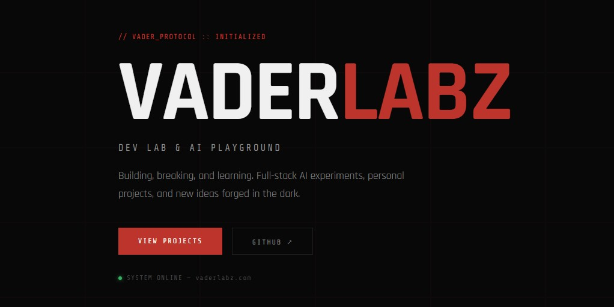
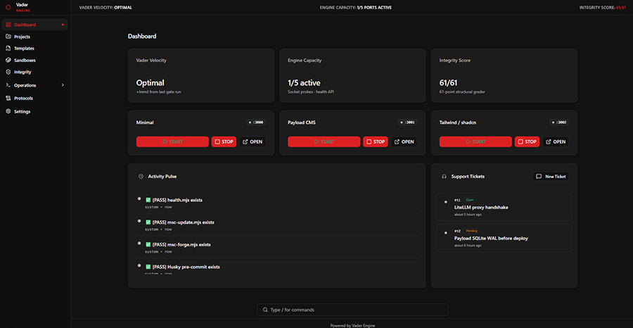
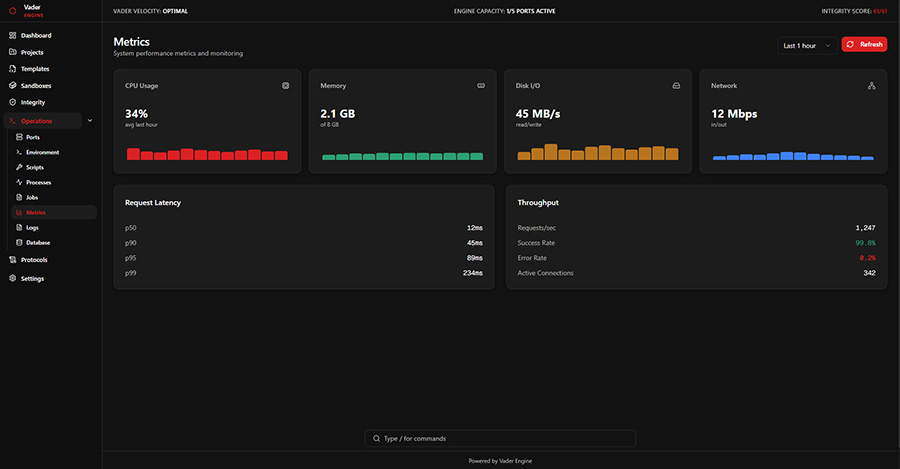
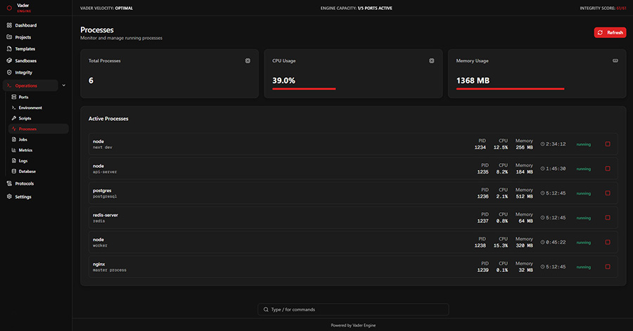

<p align="center">
  
</p>

<h1 align="center">Vader Engine</h1>

<p align="center">
  <strong>The production-hardened development factory for Cursor agents.</strong><br>
  <strong>Build production-ready applications with a visual command center,<br>
  61-point integrity verification, and triple-sandbox development environments.</strong>
</p>

<p align="center">
  <a href="https://github.com/jonbeatz/Vader-Engine/actions">
    
  </a>
  <a href="https://github.com/jonbeatz/Vader-Engine/releases">
    
  </a>
  <a href="https://vaderlabz.com">
    
  </a>
  <a href="https://github.com/jonbeatz/Vader-Engine">
    
  </a>
  <a href="https://github.com/jonbeatz/Vader-Engine">
    
  </a>
  <a href="https://github.com/jonbeatz/Vader-Engine/blob/main/LICENSE">
    
  </a>
  <a href="https://cursor.sh">
    
  </a>
</p>

---

## 📊 Current Status

| Metric | Value |
|--------|-------|
| **Version** | v2.7.0 |
| **Integrity Grade** | 61/61 (100%) |
| **Dashboard** | ✅ Vader Construct — 12+ routes on port **3010** |
| **API Layer** | ✅ 7 endpoints (health, grade, logs, projects, templates, env, scripts) |
| **Sandboxes** | ✅ 3 isolated environments (ports **3000–3002**) |
| **Templates** | ✅ 4 blueprints (`portfolio`, `divi-bridge`, `task-manager`, `vader-site`) |
| **Unit Tests** | ✅ 8/8 Vitest |
| **E2E Tests** | ✅ 6 Playwright specs (dashboard navigation + sandbox smoke) |
| **Status** | 🟢 Production Ready |

---

## 🚀 Why Vader Engine?

Most boilerplates give you files. **Vader Engine gives you a complete development operating system.**

| Capability | Vader Engine | Typical Boilerplate |
|------------|--------------|---------------------|
| Visual Command Dashboard | ✅ | ❌ |
| 61-Point Integrity Grader | ✅ | ❌ |
| Real-time Operations Hub | ✅ | ❌ |
| Triple Sandbox Architecture | ✅ | ❌ |
| Built-in Template Engine | ✅ | ❌ |
| MCP-Ready (13 servers) | ✅ | ❌ |
| Zero-Leak Security Protocol | ✅ | ❌ |
| Agent Start / End / Update Rituals | ✅ | ❌ |

---

## 🖼️ Screenshots

### Vader Construct Dashboard
<p align="center">
  
  <br>
  <em>Real-time metrics, sandbox controls, and activity feed</em>
</p>

### System Metrics
<p align="center">
  
  <br>
  <em>CPU, memory, disk I/O, and request latency monitoring</em>
</p>

### Process Manager
<p align="center">
  
  <br>
  <em>Active process monitoring with PID, CPU, and memory usage</em>
</p>

---

## 🚀 Quick Start

```bash
git clone https://github.com/jonbeatz/Vader-Engine.git
cd Vader-Engine
npm run msc:check-node          # Node 20.x–24.x preflight
npm run bootstrap               # deps, ports, env validation
cp .env.example .env.local      # (Windows: copy .env.example .env.local) then add live values
npm run msc:dev:dashboard
```

**Open `http://localhost:3010`** — the Vader Construct command center.

Verify the full baseline gate:

```bash
npm run start-project:gate      # validate-env · lint · 61/61 · 8/8 tests
```

> **Requirements:** Node 20.x–24.x (`.nvmrc` pins **20.19.1**) · npm ≥ 10  
> **Secrets:** Live keys belong in `.env.local` only — never commit or paste into chat. See [SECURITY.md](docs/SECURITY.md).

> **Agent ritual:** Say `start project` in Cursor chat for full cold-start — see [START-HERE.md](START-HERE.md).

---

## ✨ What's New

### v2.7.0 (Portable Modules & Backup System)

| Feature | Description |
|---------|-------------|
| 📦 **Portable modules** | `google-api-proxy` + `backup-system` under `.cursor/custom-scriptz/` with `install.ps1` |
| 💾 **Interactive backup** | `msc-backup.mjs` — prompts, `--yes`, `--note`, `BackUp-Notez.md` per backup folder |
| 🤖 **8-step backup ritual** | Agent conversational flow in `global.mdc`, Cheat Sheet, Operator Card |
| 📖 **Prompt-Module.md** | Canonical portable module installer for any project |

**Release notes:** [RELEASE_v2.7.0.md](docs/releases/RELEASE_v2.7.0.md)

### v2.6.1 (Documentation Polish)

| Feature | Description |
|---------|-------------|
| 📖 **Production README** | Status table, Quick Start, agent ritual pointers |
| 🪟 **Windows hint** | `.env.local` copy instruction for Windows operators |
| 🔄 **Full doc sync** | Root, `.cursor/docs`, rules, and prompts aligned to **2.6.1** |

**Release notes:** [RELEASE_v2.6.1.md](docs/releases/RELEASE_v2.6.1.md)

### v2.6.0 (Vader Construct Live)

| Feature | Description |
|---------|-------------|
| 🎨 **Complete v0 UI/UX** | Full dashboard rewrite with live data across 12+ routes |
| 📡 **7 API Endpoints** | Health, grade, logs, projects, templates, env, scripts |
| ⚡ **TanStack Query v5** | Race-condition-free fetching with skeleton loading states |
| 🧪 **E2E Test Suite** | Playwright smoke for dashboard navigation + sandboxes |
| 🔧 **Operations Hub** | Ports, logs, processes, metrics, env, and script dispatch |
| 📚 **Lean doc index** | `DOCS.md` router + agent workflow prompts (Start / End / Update Project) |

**Full release notes:** [RELEASE_v2.6.0.md](docs/releases/RELEASE_v2.6.0.md) · [RELEASE_v2.6.1.md](docs/releases/RELEASE_v2.6.1.md) · [RELEASE_v2.7.0.md](docs/releases/RELEASE_v2.7.0.md) · **Changelog:** [CHANGELOG.md](CHANGELOG.md)

---

## 🏗️ Architecture

```
Vader Engine
├── Dashboard (port 3010)    # Vader Construct UI — shells out to msc:* scripts
├── Integrity Center         # 61-point grader
├── Sandbox Manager          # 3 isolated environments (3000–3002)
├── Template Engine          # 4 blueprint scaffolds via msc:template CLI
├── Operations Hub           # Ports, logs, processes, metrics
└── CLI Engine               # msc:* script system (scripts/ + package.json)
```

**Design principle:** Lean Boundary — the dashboard never duplicates grader or health logic; API routes invoke existing root scripts.

---

## 📂 Project Structure

```
Vader-Engine/
├── ui/dashboard/          # Vader Construct (Next.js, port 3010)
├── ui/msc-shield.css      # Studio Dark token SSoT
├── examples/              # Triple sandboxes
│   ├── nextjs-minimal/    # Port 3000 — minimal frontend
│   ├── nextjs-payload/    # Port 3001 — full-stack CMS
│   └── nextjs-tailwind/   # Port 3002 — Tailwind + shadcn Path B
├── templates/             # Reusable blueprints (4 registered)
├── scripts/               # Automation & msc:* tooling
├── core/                  # Shared bridge code
├── e2e/                   # Playwright test suite
├── .cursor/               # Agent prompts, rules, skills, MCP config
├── docs/                  # Human runbooks (ARCHITECTURE, CONTRIBUTING, releases)
├── TRUTH.md               # Constitution (root — technical precedence)
└── _archive/              # Archived legacy docs (reference only)
```

---

## 📡 API Endpoints

| Endpoint | Purpose |
|----------|---------|
| `GET /api/health` | Service and port health |
| `GET /api/grade` | 61-point integrity grader |
| `GET /api/logs` | Real-time activity logs |
| `GET /api/projects` | Dynamic project discovery |
| `GET /api/templates` | Template catalog |
| `GET /api/env` | Runtime environment info (redacted) |
| `GET /api/scripts` | Available npm scripts |

---

## 🔧 Development Commands

```bash
npm run start-project:gate    # Full baseline gate (recommended before PR)
npm run grade                 # 61-point integrity check
npm run msc:dev:dashboard     # Dashboard on :3010
npm run msc:dev:example       # Minimal sandbox on :3000
npm run msc:dev:payload       # Payload sandbox on :3001
npm run msc:dev:tailwind      # Tailwind sandbox on :3002
npm run msc:template -- list  # Template catalog
npm run msc:e2e               # Playwright E2E (run msc:e2e:install first)
npm run msc:backup            # Standard backup (see msc:backup:full)
npm run dev:recover           # Clear stale caches + restart dev flow
```

Say **End Project** in Cursor chat for session closeout — see [START-HERE.md](START-HERE.md).

---

## 📚 Documentation

| Document | Purpose |
|----------|---------|
| [START-HERE.md](START-HERE.md) | Operator cold-start checklist |
| [DOCS.md](DOCS.md) | Complete documentation index (SSoT router) |
| [TRUTH.md](TRUTH.md) | Constitution — zero-leak, tokens, MCP portability |
| [PROJECT_CONTEXT.md](PROJECT_CONTEXT.md) | Architecture & onboarding map |
| [ARCHITECTURE.md](docs/ARCHITECTURE.md) | System architecture deep dive |
| [CONTRIBUTING.md](docs/CONTRIBUTING.md) | Fork, hooks, PR gates |
| [SECURITY.md](docs/SECURITY.md) | Zero-leak policy & advisory reporting |
| [TROUBLESHOOTING.md](docs/TROUBLESHOOTING.md) | Common issues & recovery |
| [CHANGELOG.md](CHANGELOG.md) | Release history |

**For Cursor agents:** [.cursor/docs/Code-Jedi.md](.cursor/docs/Code-Jedi.md) · [.cursor/prompts/Start-Project.md](.cursor/prompts/Start-Project.md)

> **Security:** `.env.local` is gitignored. Use `.env.example` for key names only. Never commit secrets.

---

## 🗺️ Roadmap

### v2.7 (Next)
- Enhanced metrics dashboard & activity timeline
- Project manager improvements
- Deeper Operations Hub integrations

### v3.0 (Future)
- Boilerplate Studio visual editor
- AI Project Builder
- Tauri desktop app

See [.cursor/plans/ENGINE_ROADMAP.md](.cursor/plans/ENGINE_ROADMAP.md) for the full integration plan.

---

## 🤝 Contributing

We welcome contributions that respect the Vader Protocol.

1. Fork the repository
2. Create a feature branch (`feat/your-feature`)
3. Run `npm run start-project:gate` — must pass **61/61** grade and **8/8** tests
4. Commit your changes (Husky runs lint + env validation)
5. Push and open a Pull Request

Please read [CONTRIBUTING.md](docs/CONTRIBUTING.md) for forge rules, template conventions, and pre-tag gates.

---

## 📄 License

MIT © [Vader Engine](https://github.com/jonbeatz/Vader-Engine)

---

<p align="center">
  <sub>Built with ☕ and <a href="https://cursor.sh">Cursor</a> · Powered by the MSC Media Engine</sub>
</p>
